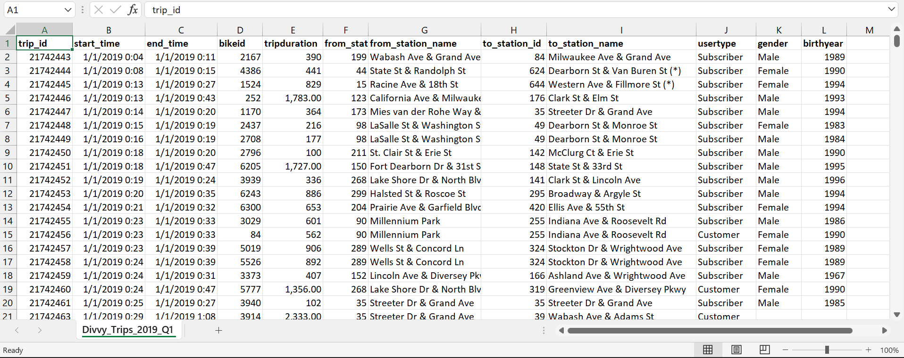
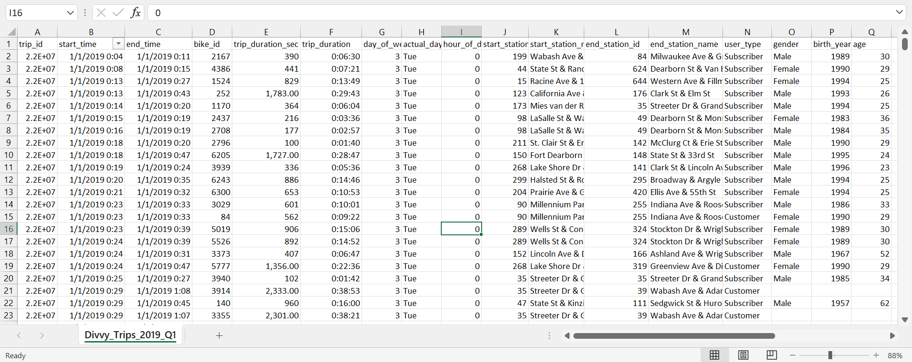
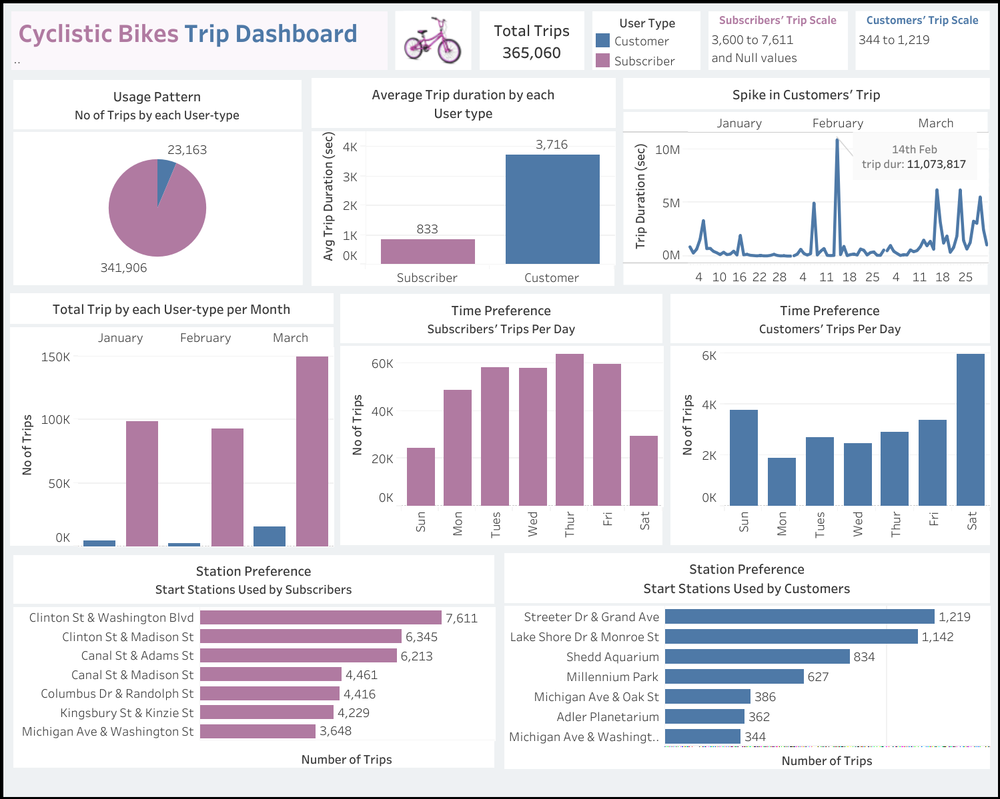
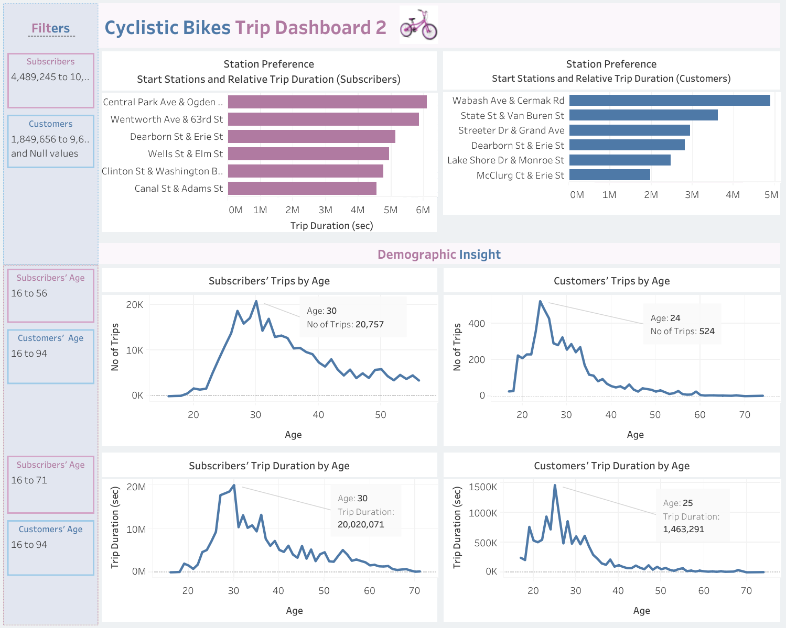

# Cyclistic Bike-share Analysis Report 

## Introduction

This capstone project, completed as part of the Google Data Analytics Professional Certificate, analyzes Cyclistic bike-share data to identify trends in rider behavior and differences between member and casual riders.  The goal is to provide data-driven recommendations to Cyclistic for converting casual riders into members.  The analysis followed the structured Case Study Roadmap from the course, which outlines six key data analysis processes which are;
- Ask
- Prepare
- Process
- Analyze
- Share
- Act

Skills Demonstrated
This project showcases skills in structured thinking, data analysis using Excel, SQL, and Tableau, data-driven decision making, and effective communication of findings.

## Scenario & Key Task

I was assuned to be a data analyst working in the marketing analyst team at Cyclistic, a bike-share company in Chicago. The director of marketing believes the company’s future success depends on maximizing the number of annual memberships. Therefore, the team wants to understand how casual riders **(Customers)** and annual members **(Subscribers)** use Cyclistic bikes differently. From these insights, the team will design a new marketing strategy to convert Customers into Subscribers. But first, Cyclistic executives must approve the team's recommendations, so they must be backed up with compelling data insights and professional data visualizations. 

- _Riders who purchase single-ride or full-day passes are referred to as casual riders or Customers_
- _Riders who purchase annual memberships are Cyclistic members or **Subscribers**_

Three questions was highlighted to guide the future marketing program:
1.	How do annual members and casual riders use Cyclistic bikes differently?
2.	Why would casual riders buy Cyclistic annual memberships?
3.	How can Cyclistic use digital media to influence casual riders to become members?

The director of marketing and manager, Lily Moreno however assigned me the first question to answer: **How do annual members and casual riders use Cyclistic bikes differently?**

## Analysis Approach
As mentioned above, the analysis process was divided into six different steps with the activities carried out under each steps documented below:

## Phase 1: Ask
This preliminary phase focused on understanding the core business problem and stakeholder expectations. Through structured thinking, I developed a series of effective questions designed to provide the necessary insights for addressing the challenge. These guiding questions are:

**Usage Patterns:** What are the differences in frequency of use between casual riders and annual members?
1. Analyze the number of trips taken by each user-type
2. Identify any seasonal or monthly trends in usage.

**Trip Duration:** Do casual riders tend to have shorter or longer trips compared to members?
1. Compare the average trip duration.
2. Explore if there’s a significant difference in the length of trips.

**Preferred Times for Riding:** What times of day and days of the week do casual riders prefer compared to members?
1. Identify peak usage times for casual riders versus members.
2. Look for differences in weekend versus weekday usage patterns.

**Station Preferences:** Are there specific start and end stations that are more popular with casual riders compared to members?
1. Identify the most popular stations for each group.
2. Explore if casual riders tend to start or end their trips in different locations than members.

**Demographic Insights:** Are there demographic differences between casual riders and members that could influence marketing strategies?
1. Analyze gender and age differences between the two groups.
2. Explore whether certain demographics are more likely to be casual riders or members.

## Phase 2: Prepare
This phase is dedicated to data sourcing, storage and credibility check. The case highlighted that I use Cyclistic’s historical trip data to analyze and identify trends. The dataset was made available by **Motivate International Inc.** under this [license](https://www.divvybikes.com/data-license-agreement).  and are available [here](https://divvy-tripdata.s3.amazonaws.com/index.html). While the project called for the most recent 12 months of trip data, Software memory constraints limited the analysis to the _**Divvy_Trips_2019_Q1 dataset**_ rather than the intended 12 months of data."

### Dataset Information
The _**Divvy_Trips_2019_Q1 dataset**_ saved in .csv format covers only the first three months of 2019 (January-March), which presents a limitation to the insights derived from this analysis.

### Data Credibility
I began by exploring the data in Excel to understand its structure and organization, which informed my subsequent assessment of its relevance and quality using the ROCCC framework (Reliable, Original, Comprehensive, Current, and Cited).

### Limitations in Dataset
A thorough examination of the dataset revealed data quality issues that required attention:
1. **Short-term Data Constraint:** The dataset's three-month span limited the ability to identify long-term trends such as seasonal or monthly variations, leading to results based on short-term fluctuations. For more reliable insights, a dataset covering at least a year is recommended.
   
2. **Insufficient Station Information:** More information is needed to reach concrete conclusions from station preference analysis. Information such as the regions of the recorded stations within the country will be of great help in trapping areas populated by certain user-type, possible reasons and modifications.

## Phase 3: Process 
This phase is dedicated to series of data cleaning, manipulation, choosing of tools and documentation of cleaning process. 

### Data Cleaning
With the data's relevance and credibility established, I proceeded with an in-depth exploration to ensure its accuracy.  This included validating data types, checking for consistency and adherence to constraints and ranges, and identifying missing values and duplicates.

### Data Manipulation
The following data manipulations were performed to prepare the dataset for analysis:

- **Relabelling:** Several column headers were renamed for clarity and consistency.  These changes included:
  - bikeid to bike_id,
  - tripduration to trip_duration_sec,
  - from_station_id to start_station_id
  - from_station_name to start station_name
  - to_station_id to end_station_id
  - to_station_name to end_station_name
  - usertype to user_type
  - birthyear to birth_year

- **Trip Duration Calculation:** Two distinct representations of trip duration were employed in this analysis. The 'trip_duration (sec)' column, presumed to represent durations in seconds, was validated against a newly generated 'trip_duration' column calculated by subtracting the **'started_at'** timestamp from the **'ended_at'** timestamp. The latter was formatted as HH:MM:SS, utilizing the 37:30:55 format within Excel to accommodate durations exceeding 24 hours. This approach facilitated both data validation and subsequent analysis utilizing a more readily interpretable time format.
- **Day of Week Calculation:** A 'day_of_week' column was created using the WEEKDAY function to extract the day of the week from the 'started_at' timestamp for each ride."
- Calculated the average trip duration
- Determined the longest trip duration
- Identified the most frequent day of the week for rides using the **'day_of_week'** column."
- Created a pivot table to quickly calculate and visualize the data. 

## Analyze & Share
With the data now stored appropriately and ready for analysis, I uploaded it to SQL (BigQuery) and Tableau, and began to find answers to the questions in the ask phase in order to address the key business question **"How do Customers and Subscribers use bikes differently?"**  These answers were showcased through compelling visuals so as to effectively communicate key findings in a clear and accessible manner.

### 1. Bike Usage Pattern and Trip Duration
- In total, subscribers took way more trips (341,906) than customers (23,163). However, customers were observed to have taken way longer trips averagely 3716 seconds, than subscribers whose trips average a duration of just 833 seconds.
  
- Aside customers generally associated with longer trips, the trip taken by a customer on February 14th which went on to last for over 11 million seconds was significantly higher compared to others with the next long trip last for just over 6 million seconds (6,228,252 seconds). 
Recall that this same day happened to be the Valentines’ Day. Although, this does not necessarily imply that there is a correlation or causation as more data is needed to reach a conclusion on that.

### 2. Time Preference
- While customers were observed to have taken more rides on weekends, reverse is the case for subscribers.
   
- Of all three months considered for analysis (Jan, Feb and March), both user-type have similar monthly usage patterns with most trips taken in March, followed by January and then February. Note, this information is not sufficient enough to inform decision due to the limited number of months as explained above. For example, the result of the monthly preference might have been significantly influenced by the number of days in each month. 

### 3. Station Preference: 
While the start station Clinton & Washington Blvd accommodated most trips for subscribers, the station Streeter Dr & Grand Ave accommodated most of Customers’. 

### 4. Demographic Insight
Both the longest and highest number of trips taken among subscribers were from the age group of 30. But for customers, the age 30 groups were seen to take the highest number of trips, while the age group of 25 took the longest trips

## Conclusion
This analysis of Cyclistic data reveals key differences between subscribers and casual customers. Subscribers, though more numerous, take shorter, weekday-focused trips, suggesting commuter use. Casual customers, while fewer, take longer, weekend-oriented rides, likely for leisure. Station and demographic preferences further distinguish these groups.  However, limited data (three months) and outliers necessitate further analysis for definitive conclusions.
